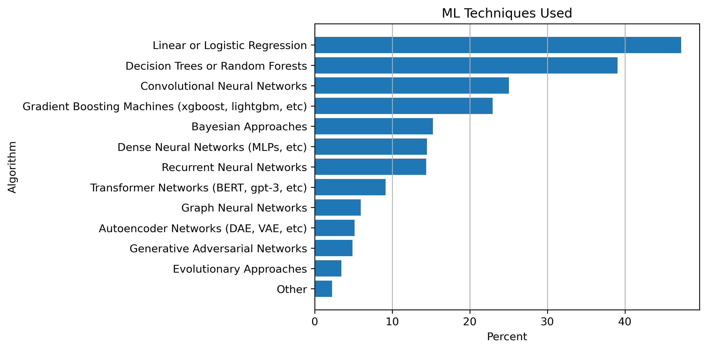

# Machine Learning Topic Outline
## Semester 1: Classical Machine Learning

### 1. **Introduction to Machine Learning**
   - Definition and Scope of Machine Learning
   - Historical Context and Evolution of Machine Learning
   - Types of Machine Learning: Supervised, Unsupervised, and Reinforcement Learning
   - Applications of Machine Learning in Various Fields

### 2. **Supervised Learning Basics**
   - Overview of Supervised Learning
   - Types of Supervised Learning Problems: Classification and Regression
   - Key Concepts: Training Data, Test Data, Features, Labels
   - Model Evaluation: Training vs. Testing, Overfitting, and Underfitting
   - Performance Metrics: Accuracy, Precision, Recall, F1 Score, and Mean Squared Error

### 3. **Linear Models for Regression**
   - Simple Linear Regression
   - Multiple Linear Regression
   - Assumptions of Linear Regression
   - Model Evaluation: R-squared, Adjusted R-squared, and Residual Analysis
   - Regularization Techniques: Ridge Regression and Lasso

### 4. **Classification Algorithms**
   - Logistic Regression
   - k-Nearest Neighbors (k-NN)
   - Decision Trees
   - Naive Bayes Classifier
   - Model Evaluation for Classification: Confusion Matrix, ROC Curve, and AUC

### 5. **Feature Engineering and Selection**
   - Importance of Feature Engineering
   - Techniques for Feature Selection: Forward Selection, Backward Elimination, and Recursive Feature Elimination
   - Handling Categorical Features: One-Hot Encoding, Label Encoding
   - Feature Scaling: Standardization and Normalization

### 6. **Unsupervised Learning**
   - Overview of Unsupervised Learning
   - Clustering: k-Means, Hierarchical Clustering, and DBSCAN
   - Dimensionality Reduction: Principal Component Analysis (PCA) and Singular Value Decomposition (SVD)
   - Anomaly Detection

### 7. **Model Evaluation and Validation**
   - Cross-Validation Techniques: k-Fold Cross-Validation, Leave-One-Out Cross-Validation
   - Bias-Variance Tradeoff
   - Hyperparameter Tuning: Grid Search, Random Search

### 8. **Ensemble Methods**
   - Concept of Ensemble Learning
   - Bagging: Bootstrap Aggregating, Random Forest
   - Boosting: AdaBoost, Gradient Boosting
   - Stacking: Combining Multiple Models for Improved Performance

### 9. **Introduction to Support Vector Machines (SVM)**
   - Concept of Margin and Support Vectors
   - Linear SVMs and the Kernel Trick
   - Non-linear SVMs
   - Tuning SVMs: Regularization Parameter, Kernel Functions

### 10. **Ethics and Fairness in Machine Learning**
   - Bias in Machine Learning Models
   - Fairness in Model Development
   - Responsible AI and Ethical Considerations

### 11. **Practical Considerations and Tools**
   - Data Preprocessing and Cleaning
   - Introduction to ML Libraries: scikit-learn, pandas, and matplotlib
   - Implementing Classical ML Algorithms in Python
   - Best Practices for Developing Machine Learning Models

### 12. **Capstone Project and Review**
   - Students choose a dataset and apply various classical ML techniques learned throughout the course.
   - Final Review: Revisiting Key Concepts and Q&A

This outline ensures that students get a solid foundation in classical machine learning methods before delving into more advanced topics like neural networks and deep learning.

## Top Algorithms 2022

Here are the results of a survey of Kaggle user who were asked "Which of the following techniques
do you use regularly?" Multiple answers per response were allowed. Source: https://www.kaggle.com/competitions/kaggle-survey-2022/data

