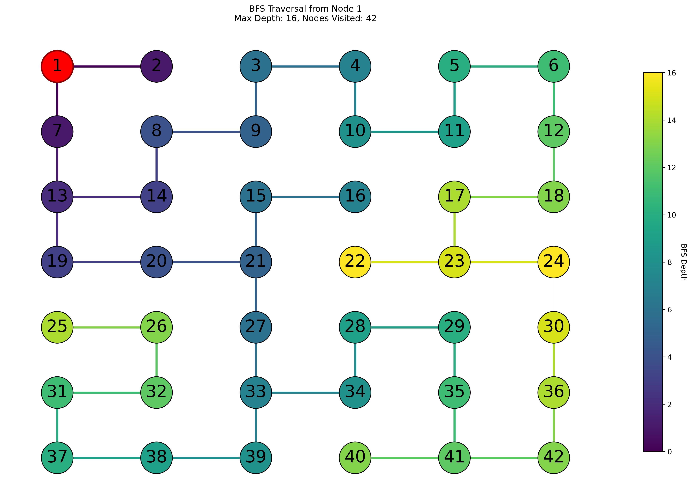

Here is a simple maze puzzle with each valid grid square labeled 1-42. The
start state of the maze is grid #1 and the goal state is grid #42. We will
look at the behavior of BFS and DFS on this maze.

## Breadth First Search

Create a BFS search tree to solve the maze. When listing the
children of any node, list them in increasing numerical order. Also you
should avoid repeating the same node anywhere in the tree.








What is the length of the solution path found by BFS?



The shortest path has 14 nodes, counting the root and the goal




Is BFS guaranteed to find the shortest solution path?



Yes, always, because it expands every node at depth $n$ before it expands any node at depth $n+1$




In a maze with *n* nodes, what is the worst case running time of BFS?



$O(n)$ because BFS will, in general, search the whole tree. If the solution is very short, it can stop early. But it has to find every path at least as long as the solution path.



## Depth First Search

Now create a DFS tree for the same maze. Again be
sure to explore the children of a state in increasing numerical order.
Keep track of visited states because DFS only stops when it hits the
goal or runs out of states to explore.


Create the DFS tree, expanding the highest value child first, and avoiding duplicates



TBD



Was the DFS path longer than the BFS path? DFS will not, in general, find the optimal path.

So why ever use DFS? It's all about space! DFS uses significantly less memory than BFS on large trees. If you had a tree with the optimal solution at depth 100, BFS would have to expand every node and every child at every level 1-99 before it ever found the optimal solution. DFS, on the other hand, just takes one path at a time from depth 1-100. It may have to search a lot of paths, but it will never take *longer* than BFS (in the worst case -- you can always get lucky and have a counterexample), and it will always use less space.