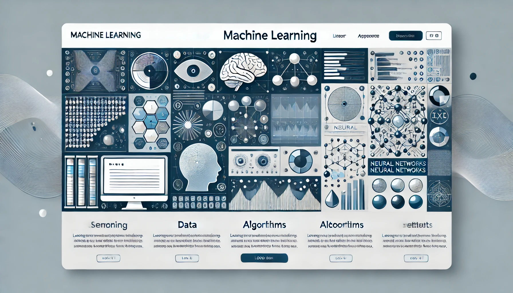

# Machine Learning

  * Instructor: Dr. White
  * Room: 2312
  * Meeting Days: Block 3, A days

## Welcome

Welcome to the Junior Research Machine Learning class. This course has a dual focus:
to develop a thorough understanding of machine learning algorithms and data analysis
techniques, and also to help develop your innate ability to be creative.

## About this Class

In this course, we will cover a wide range of ML topics, including:

- **Supervised Learning**: Learn about regression, classification, and model evaluation.
- **Unsupervised Learning**: Explore clustering, dimensionality reduction, and anomaly detection.
- **Neural Networks**: Get hands-on with deep learning architectures like CNNs and RNNs.
- **Reinforcement Learning**: Understand how machines can learn from their environment through trial and error.

We will also discuss techniques for finding and cleaning data sets,
pre-processing and wrangling data before you can feed it to an ML algorithm, and the
many various (and sometimes contradictory) ways you can interpret your results.

The research part of this class includes many facets, including brainstorming ideas,
presenting to the class, reading articles, discussing articles and ideas in groups and
working on whatever interests you in short or long term projects supported by the teacher
and your classmates.

### Homework etc

Most of your classwork/homework will be centered on writing python scripts to analyze datasets.
Some projects will be short that you can do in 20-30 minutes. Some will take much longer. Additionally we will have research-related activites like described above, sprinkled throughout the course.

### Class Calendar

- **[Assignments here](calendar.md)**

## Resources

### Class Related
- **[Machine Learning for OpenCV Textbook Online](https://github.com/AET-CS/opencv-machine-learning/tree/master)** a forked github repo with lessons on ML we will use in class
- **[Class Datasets](https://github.com/AET-CS/ML-datasets)** this repo will contain datasets that we use in class. You should clone it using `git` and periodically update your local copy (we'll learn how to do this in class but you should install `git` if you haven't already.)

### Research Related
- **[Research](background.md)** a collection of news and journal articles featuring computer science

### ML Topic Outlines
- **[Semester One](outline-01.md)** (draft, unofficial) topic outline for classical machine learning techniques
- **[Semester Two](outline-02.md)** topic outline
for deep learning techniques

### Books

- **[Pattern Recognition and Machine Learning](https://www.springer.com/gp/book/9780387310732)** by Christopher Bishop
- **[Deep Learning](https://www.deeplearningbook.org/)** by Ian Goodfellow, Yoshua Bengio, and Aaron Courville
- **[The Elements of Statistical Learning](https://web.stanford.edu/~hastie/ElemStatLearn/)** by Trevor Hastie, Robert Tibshirani, and Jerome Friedman

### Websites

- **[Kaggle](https://www.kaggle.com/)**: A great platform to practice ML with real-world datasets. (blocked by LCPS)
- **[Scikit-learn](https://scikit-learn.org/)**: A Python library for simple and efficient tools for data analysis.
- **[TensorFlow](https://www.tensorflow.org/)**: An open-source platform for machine learning by Google.
- **[ArXiv](https://arxiv.org/)**: Access the latest research papers in AI and ML.

## Navigation
  * Go to [course list](../../index.md)