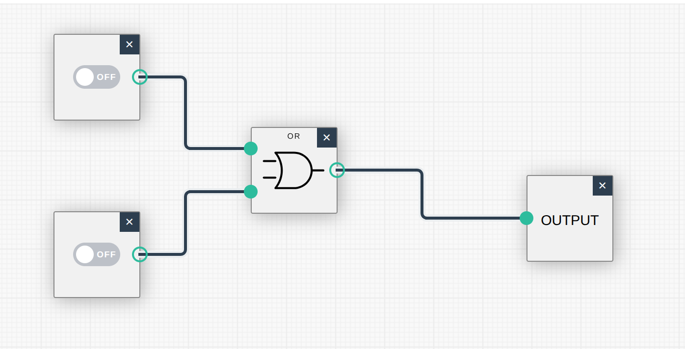
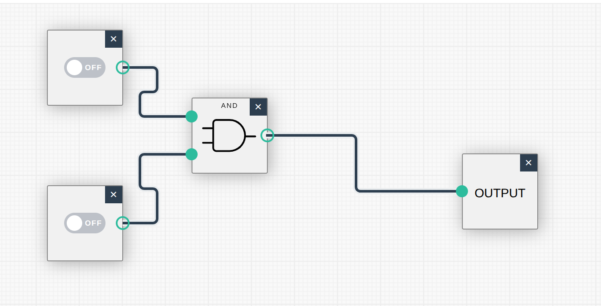
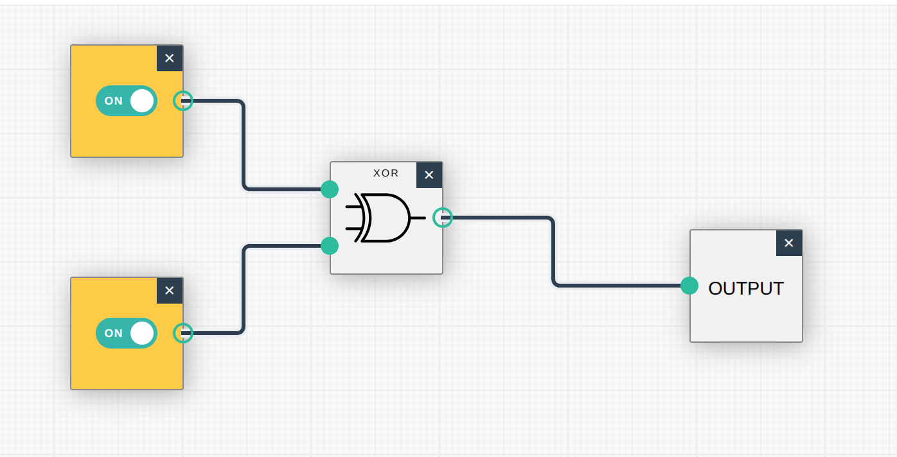
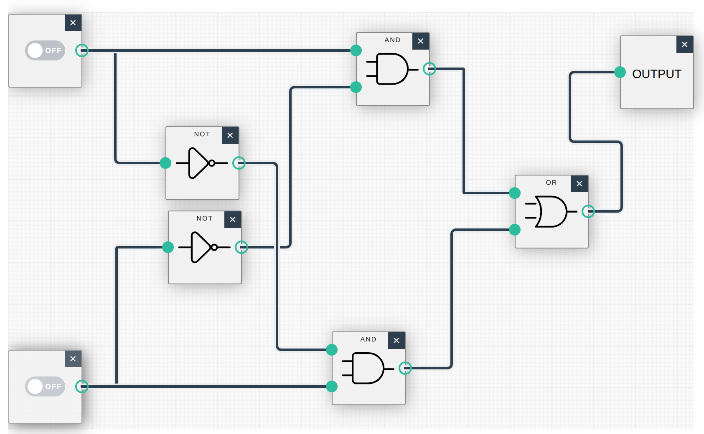
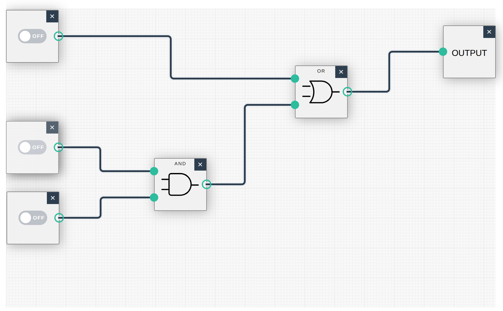
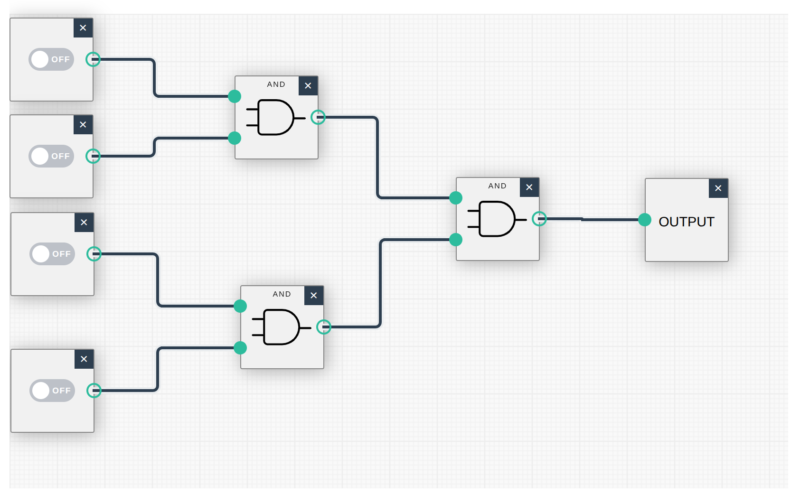
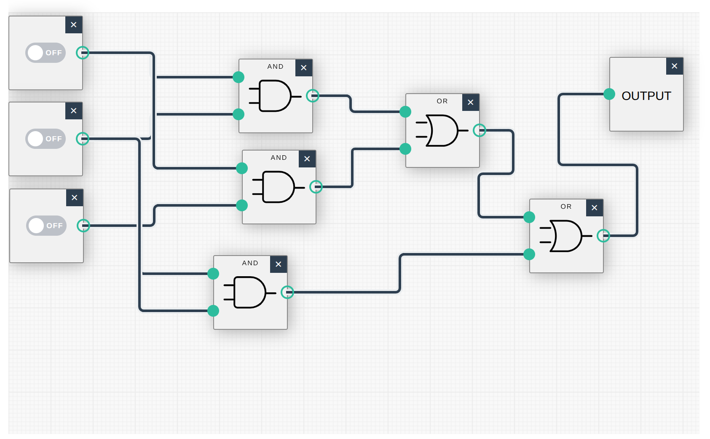
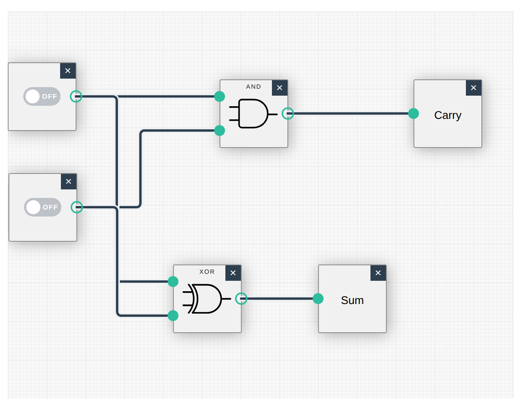
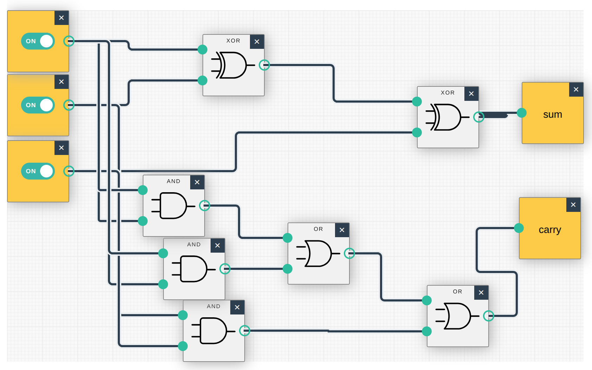

1. A light bulb is connected to two switches. It lights if either switch is ON (or both).
   
2. A microwave oven is installed in a kitchen. It powers on only when the breaker is ON and the user presses START.
   
3. A kitchen light is connected to two toggle switches. When both switches are off the light is OFF. If ONE switch is on the light is on, but if the OTHER switch is also on, the light turns off. **This is the definition of an `xor` gate, or you can solve it directly as shown in the second image.
   
   
4. Model UN is trying to decide whether to meet this week. They will take a vote and meet only if the President votes YES OR the vice-president and secretary BOTH vote yes.
   
5. CSHS wants to change their name to "1337 H4XORz" but the idea is so bad they will only take action if all four board members vote to do so.
   
6. Design a 3-Majority circuit. It has 3 inputs and outputs TRUE if and only if at least 2 inputs are true.
   
7. Design a half-adder. When you add two binary digits you get a SUM bit and a CARRY bit, e.g. 0+0 = 0, 0+1 = 1, 1+0 = 1, 1+1 = 10. The only CARRY bit occurs when adding 1+1. You will design a half-adder circuit using two inputs and two outputs. **Carry bit is an `and` gate, and the sum bit is `xor`.**
   
8. Design a full-adder. It is like a half adder but it also has a CARRY input. So 3 in, 2 out. **The carry bit is a majority circuit, and the sum bit is on if and only if an odd number of inputs is true. You should convince yourself that this is the same as (A xor B xor C), as shown.**
   
