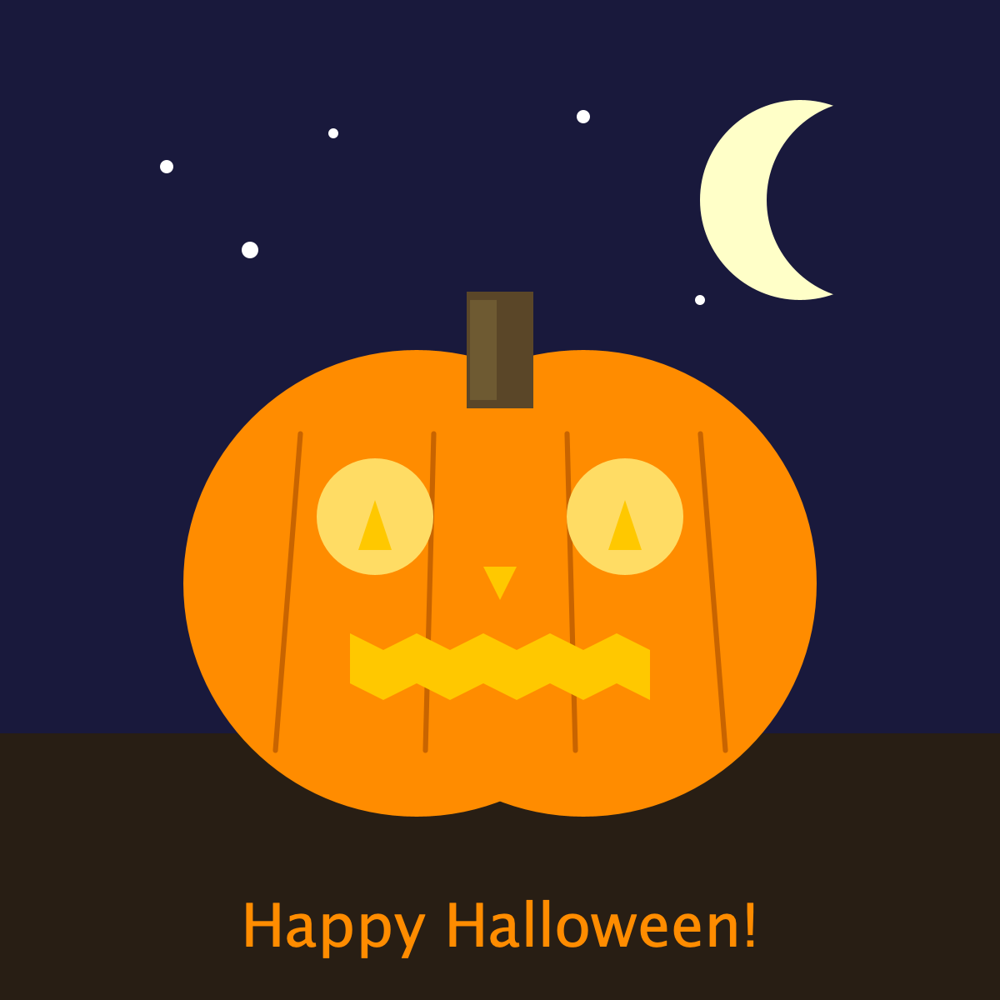
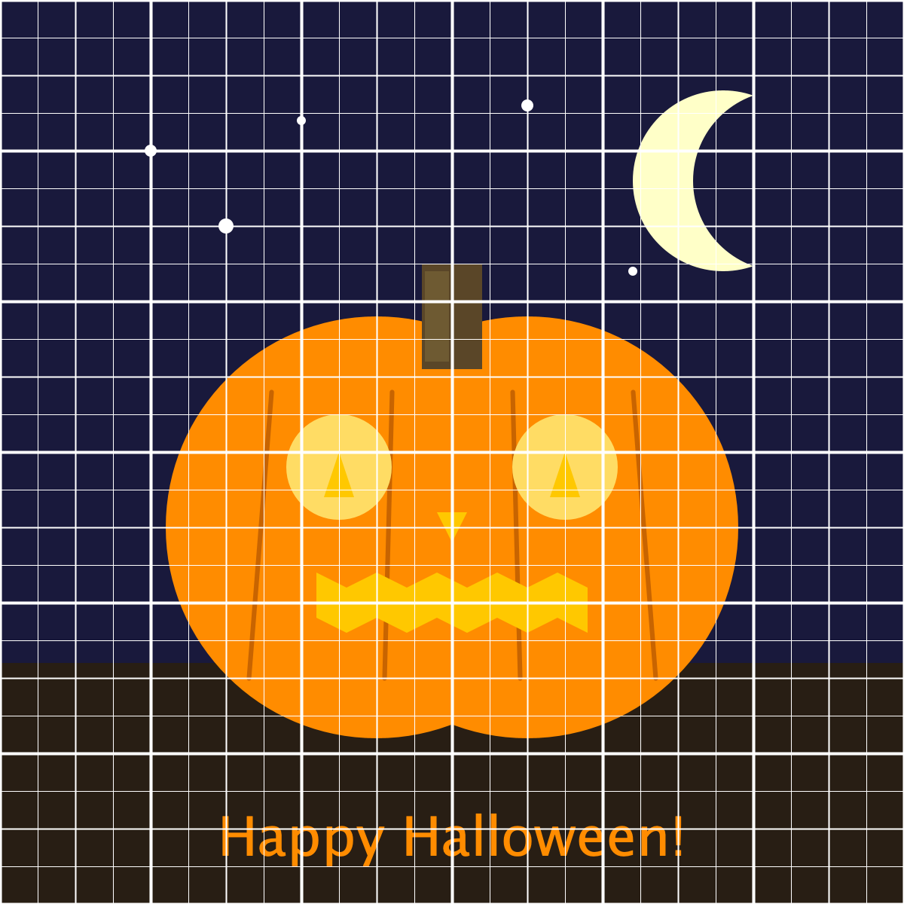
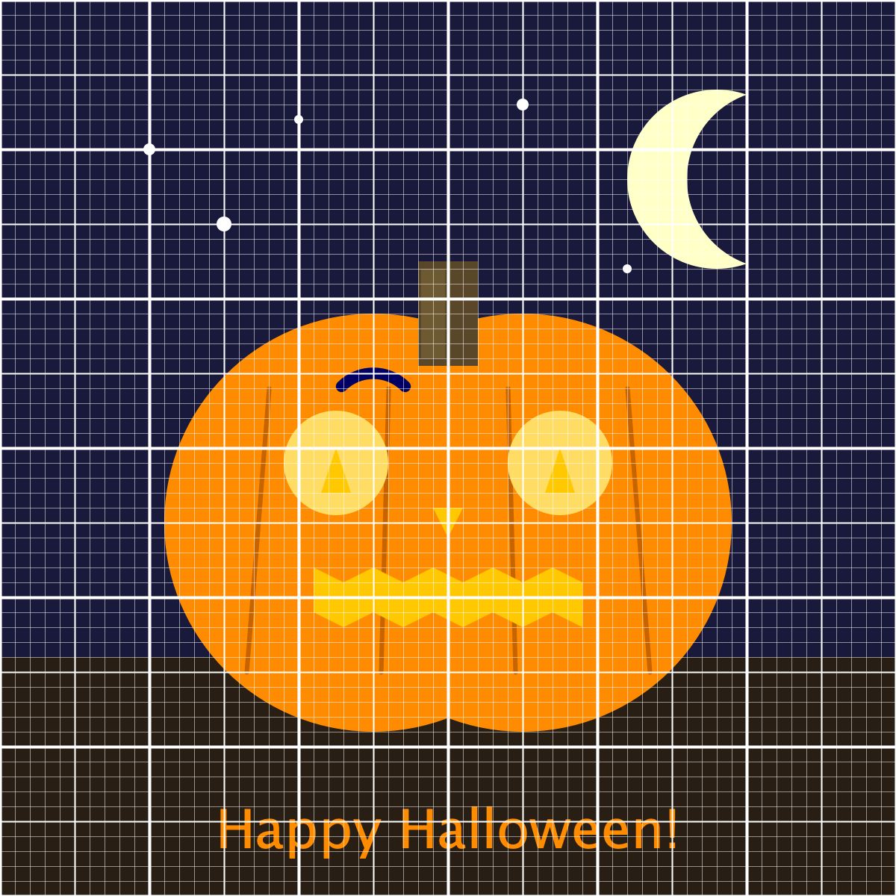

Your task is to create a pumpkin that matches the picture below. While creativity is encouraged, the main part of the assignment is to match the pumpkin given as closely as possible. You may use the built-in drawing tools from Princeton's CS1 stdlib.jar file. Here are some tips and pointers

1. Start drawing the background first -- drawn elements appear on top of earlier elements
2. You can use an [RGB Color Picker](https://rgbcolorpicker.com/) to choose your colors. (The eyedrop will sample any color from your screen. Handy for "Blue Dress / Gold Dress" puzzles).
3. The moon is 2 circles. So is the pumpkin
4. The mouth is a polygon.
5. Make the stars with a `for` loop and random numbers (for example use `(int)(Math.random()*100)` to make a random number from 0-99). Randomize the location and the radius, but don't put stars on the ground.
6. You should define some variables for the center point between the two eyes, and reuse that variable for all the eye shapes

## Images

Here's the image

And here's a version with a 25 pixel grid.

And here's a version with a 10 pixel grid.

## Extensions

1. Take user input for things like eye radius, distance between eyes, mouth size, etc. and vary the picture based on input.
2. Define a 'center' variable and make the entire pumpkin a function of the center.
3. Make a glow effect by drawing the eyes as a series of concentric circles that get smaller and slightly brighter.
4. As in 2, define a 'scale' variable so changing the scale resizes the whole pumpkin.
5. Animation! (for example, flashing mouth, jiggling eyes, dancing pumpkin, shooting stars, flying pumpkin, exploding pumpkin)
    1. Here's a sample animation [file](./drawing/Jiggler.java). You can add it to your pumpkin project src file and choose "run current file" to see how it works.
    2. The main idea behind animation is : turn on double buffering, clear the screen, draw an image, and put it all in a loop. The image should change on each frame.