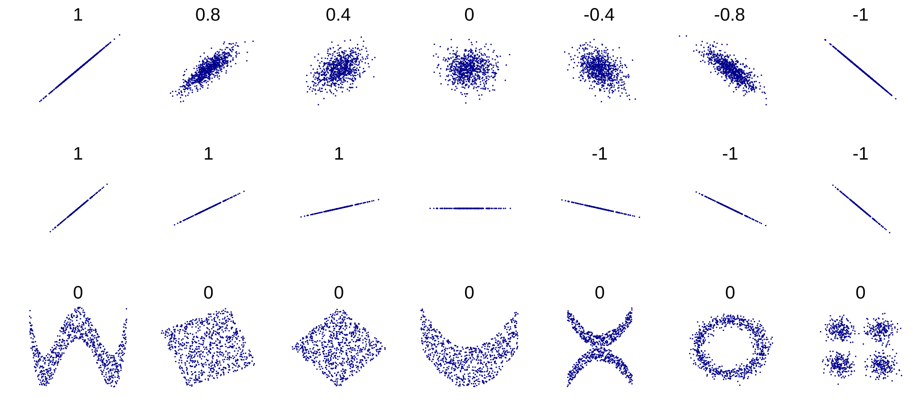

We assume, as usual, a ground truth model $y = f(x) + \epsilon$ where $f$ is usually unknown, a (possibly random) sample of points $(x_1, y_1), \cdots, (x_n, y_n)$ and a computed linear model $\tilde{y} = ax + b$. In this setting we usually need to know *how good* the linear model is -- how well does if capture the ground truth $f(x)$?

One obvious measure is the sum of squared errors, which we minimized last class to derive the linear regression equations.

$$SSE = \sum_{i=1}^n (\tilde{y}_i - y_i)^2$$

While this literally captures the error in the model on each point, it is hard to interpret, it scales with the number of points, and is in different units from the given data. We can normalize it to the mean sum of squared errors:

$$MSE = \dfrac{1}{n}\sum_{i=1}^n (\tilde{y}_i - y_i)^2$$

which at least doesn't scale with the number of points but is in different units. Thus by taking a radical

$$RMSE = \sqrt{\dfrac{1}{n}\sum_{i=1}^n (\tilde{y}_i - y_i)^2}$$

we get the root mean sum of squared errors. This at least scales with the magnitude of the $y$ values, so you can interpret it somewhat. It is also similar
to a standard deviation, which is familiar to many people. (Note some texts would divide by $n-2$ instead of $n$ to create a truly unbiased
estimator for the standard deviation, but this simpler version agrees with other data science presentations, including kaggle.)

## The Coefficient of Determination

While variants of SSE have their place, one cannot escape the use of $R^2$, the Coefficient of Determination. Students learn in algebra classes
that a linear regression coefficient $r=1$ is a perfect positive correlation and $r=-1$ is a perfect negative correlation and $r=0.5$ is a weak
correlation, for example. This $r$ is "Pearson's Correlation" and is different from the $R$ in $R^2$. So if you know about $r$ and $r^2$ from linear regression in another
course, forget them all for now!

### The linear least squares $R^2$

The main formula for $R^2$ relative to our purposes now is

$$R^2 = \dfrac{SS_{reg}}{SS_{tot}} = \dfrac{\sum_i(\tilde{y}_i - \overline{y})^2} {\sum_i(y_i - \overline{y})^2}$$

Let's unpack this. $SS_{reg}$ is the sum of squared-error due to regression and $SS_{tot}$ is the sum of squared-error total (due to the original data).
Here $\overline{y} = \frac1n\sum_i y_i$ is the mean of the observed $y_i$ values. $SS_{tot}$, then, is the variance of the observed $y_i$ values -- it is the
sum of the squared deviations of the observations from their mean.

$SS_{reg}$, on the other hand, is the variance of the predicted $\tilde{y}_i$ values, relative to the same observed mean.

The ratio of the two is the ratio of the "explained variance" to the "total variance." There is always variance in the original dataset. If our linear
model very closely fits the data, then it will explain most of that original variance. That would correspond to a high $R^2$ value (which is at most $1$). On the other hand
a low $R^2$ indicates that there is variance in the data that is not capture by the linear model. Something else is happening to create this
data shape.

It can be helpful to think of $R^2$ as the "percent of explained variance". This conceptual understanding is, honestly, vastly more important than knowing the
formula for $R^2$

### The general $R^2$

When the predicted model for $\tilde{y}$ comes from a linear least squares regression, the above formula for $R^2$ is valid -- but it is actually a simplification
of the general form for $R^2$, which applies to *any* two vectors $y$ and $\tilde{y}$. For example $\tilde{y}$ could be a best fit according to a neural network, or a random forest.
Or $\tilde{y}$ could literally be anything. This general definition always applies when you have two vectors of data.

$$R^2 = 1 - \dfrac{SS_{res}}{SS_{tot}} = \dfrac{\sum_i(\tilde{y}_i - y_i)^2} {\sum_i(y_i - \overline{y})^2}$$

Here the numerator is the sum of squares of the residuals. In the least squares case, this formula simplifies to the one
we first gave. But in general it looks like this. The interpretation is the same ("explained variance") but a curiousity is that
this $R^2$ can be arbitrarily small! Yes, that means negative. Of course, a negative value means the 'fit' is *worse* than any linear regression could be, but
it is mathematically possible.

## Pearson's $r$

So now let's come back to Pearson's correlation coefficient. It is *very* different -- it measures the strength of a linear relationship
between two variables $x$ and $y$, given a sample of ordered pairs $(x,y)$. This Pearson "r" does appear squared at times, $r^2$, and it
is the inspiration for the *name* of $R^2$. To make matters worse, in the case of single-variable linear regression, their values are the same! Nevertheless,
we will not speak much about $r$ or $r^2$ in Machine Learning. It is useful, though, to note one important peculiarity that we can add to our list of
examples that demonstrate one number is frequently insufficient to describe a complex relationship between data.

You may have been taught that $r=0$ implies no correlation between $x$ and $y$ pairs. This is often indicated in math books with an
amorphous cloud of points, wandering lonely across the page, enigmatic and unknowable. Actually a number of highly correlated
datasets can claim to possess $r=0$ values as this helpful chart shows[^1]

To be correct, $r=0$ implies no **linear** correlation between $x$ and $y$. If it so happens that every predicted $\tilde{y}_i$ value is identical to the
mean $\overline{y}$, then $r^2=0$. Datasets with perfect vertical symmetry can have this property.

[^1]: By DenisBoigelot, original uploader was Imagecreator - Own work, original uploader was Imagecreator, CC0, https://commons.wikimedia.org/w/index.php?curid=15165296