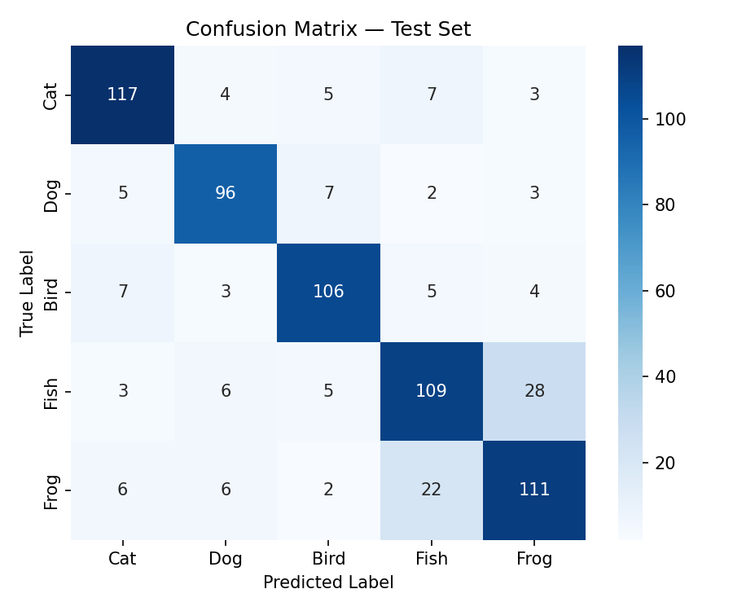
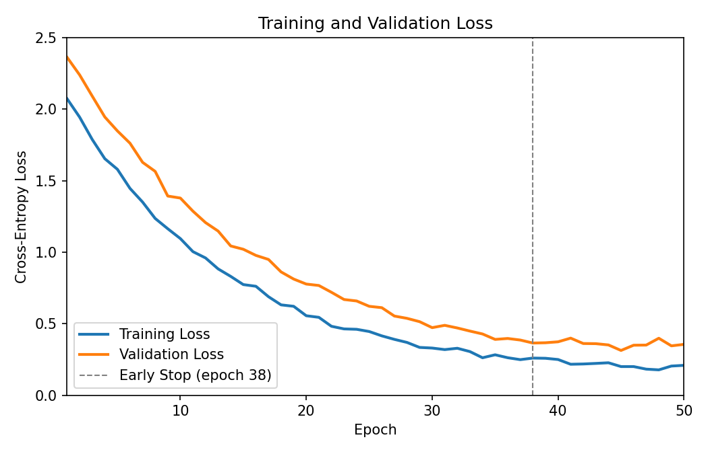
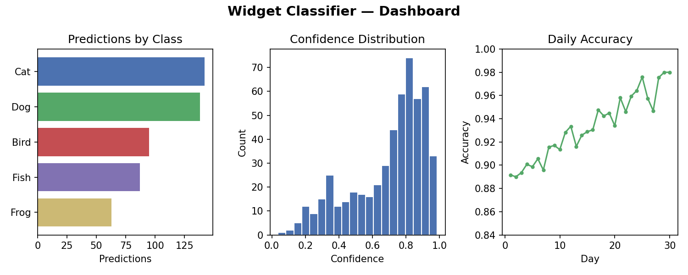

<!-- ============================================================
     CS SENIOR RESEARCH — FINAL RESEARCH PAPER TEMPLATE
     ============================================================
     Build command (with pandoc-crossref for auto-numbered figures):

       pandoc paper.md -o paper.pdf \
         --filter pandoc-crossref \
         --citeproc \
         --number-sections \
         -V geometry:margin=1in \
         -V fontsize=12pt

     Without pandoc-crossref (manual numbering):

       pandoc paper.md -o paper.pdf \
         --citeproc \
         --number-sections \
         -V geometry:margin=1in \
         -V fontsize=12pt

     NOTE: All examples below are shown BOTH ways so you can
     pick whichever toolchain you have installed.
     ============================================================ -->


# Abstract {-}


_State the problem, the methods, the solution, the results_. This document is an example of how to use pandoc/markdown and **NOT necessarily** a template for your actual paper contents. See the rubric for paper guidelines!


# Introduction

Notice the Introduction is a SECTION. Sections can have SUBSECTIONS (seen later)

Open with the broad problem area and narrow toward your specific research question. Why should the reader care? Ground the motivation in real-world impact or a gap in the literature.

Discuss existing solutions and their shortcomings. For example, Smith et al. demonstrated that convolutional approaches plateau at roughly 87% accuracy on this task [@smith2024], while the transformer-based method of Jones and Lee [@jones2025] improved recall but at significant computational cost.

<!-- ── Citation examples ────────────────────────────────────── -->
<!-- These use Pandoc's --citeproc with a .bib file.            -->
<!--   Single citation:          [@smith2024]                   -->
<!--   Multiple citations:       [@smith2024; @jones2025]       -->
<!--   Suppress author name:     [-@smith2024]                  -->
<!--   Add page number:          [@smith2024, p. 12]            -->
<!--   Inline (author as noun):  @smith2024 showed that...      -->
<!-- ────────────────────────────────────────────────────────── -->

Summarize what you accomplished: _"In this paper we present [X], a [brief description]. Our system achieves [key metric] on [dataset/benchmark], representing a [Y]% improvement over [baseline]. We additionally contribute [secondary contribution, e.g., a curated dataset, an open-source tool, a novel evaluation protocol]."_

The remainder of this paper is organized as follows. Section 2 details the procedure and experimental design. Section 3 presents results. Section 4 offers conclusions and future work.


# Procedure

Another example of a SECTION
<!-- Rubric checklist:
       ✓ Detail explicitly how another person can replicate your work
       ✓ Clearly discuss software, algorithms, materials, experimental design
       ✓ Provide links to downloaded resources
       ✓ Link to your code repo on GitHub
       ✓ Do NOT discuss failures, side-steps, or deviations from original plan
-->

## Software and Environment

You may have SUBSECTIONS. Not required but sometimes helpful.

All source code is available at <https://github.com/yourusername/your-repo>.

| Component        | Detail                          |
|------------------|---------------------------------|
| Language         | Python 3.12                     |
| ML Framework     | PyTorch 2.3                     |
| Key Libraries    | scikit-learn 1.5, pandas 2.2    |
| Hardware         | NVIDIA RTX 4070, 12 GB VRAM     |
| Training Time    | ~4 hours per full run           |

## Data

Describe the dataset source, size, and how you obtained it. Provide download links or DOIs. Explain preprocessing steps (cleaning, tokenization, normalization, augmentation, train/validation/test splits) in enough detail for replication.

<!-- ── Footnote example ─────────────────────────────────────── -->
The dataset was obtained from the UCI Machine Learning Repository[^1].

[^1]: <https://archive.ics.uci.edu/ml/datasets/Your+Dataset> — accessed April 2026.
<!-- ────────────────────────────────────────────────────────── -->

## Algorithm / Approach

Describe your method at a level of detail sufficient for replication. Use pseudocode where it adds clarity:

```
Algorithm: DESCRIPTIVE-NAME
Input:  X (feature matrix, n × d), y (labels, n × 1)
Output: trained model M

1. Split X, y into train/val/test (80/10/10)
2. For each epoch e = 1 … E:
   a. Compute forward pass: ŷ = M(X_train)
   b. Compute loss: L = CrossEntropy(ŷ, y_train)
   c. Backpropagate and update weights
   d. If val_loss has not improved in P epochs: early stop
3. Return M
```

## Experimental Design

Explain how you evaluated your system: what baselines you compared against, how many runs you averaged over, what hyperparameter search you performed, and what metrics you chose and why.


# Results

<!-- Rubric checklist:
       ✓ Clear mathematical / quantitative review of results
       ✓ Valid and appropriate metrics (accuracy, precision, recall,
         F1, p-value, etc.)
       ✓ Every claim supported with evidence, charts, graphs
       ✓ Discuss final product (app, website, model) with photos/screenshots
-->

## Quantitative Results

Summarize performance in a table. Reference it in your prose using the label (see below).

<!-- ── Table with cross-ref (pandoc-crossref) ───────────────── -->

| Model           | Accuracy | Precision | Recall | F1   |
|-----------------|----------|-----------|--------|------|
| Baseline (SVM)  | 0.872    | 0.861     | 0.880  | 0.870|
| Our Method      | 0.942    | 0.938     | 0.947  | 0.942|

: Comparison of classification performance on the test set. {#tbl:results}

<!-- Reference this table anywhere with: [@tbl:results]         -->
<!-- Renders as: "Table 1"                                      -->

As shown in [@tbl:results], our method outperforms the SVM baseline by 7.0 percentage points in accuracy.

## Figures and Visualizations

<!-- ══════════════════════════════════════════════════════════
     FIGURE EXAMPLES — pick the style that fits your toolchain
     ══════════════════════════════════════════════════════════ -->

<!-- ── OPTION A: pandoc-crossref (auto-numbered, cross-ref) ── -->

{#fig:confusion width=70%}

<!-- Reference it with:  [@fig:confusion]   → renders as "Figure 1" -->

[@fig:confusion] shows that most misclassifications occur between classes 3 and 5, which share visual similarity.

<!-- ── OPTION B: raw LaTeX (if you want precise control) ───── -->
<!--
\begin{figure}[H]
  \centering
  \includegraphics[width=0.7\textwidth]{figures/confusion_matrix.png}
  \caption{Confusion matrix for our best model on the held-out test set.}
  \label{fig:confusion}
\end{figure}

Reference with: Figure \ref{fig:confusion}
-->

<!-- ── OPTION C: plain markdown (no auto-numbering) ────────── -->
<!--


Then reference manually in text: "as shown in Figure 1..."
-->

<!-- ── Sizing & centering cheat sheet ─────────────────────── -->
<!-- pandoc-crossref / Pandoc:                                 -->
<!--   width=50%          — percentage of text width           -->
<!--   width=4in          — absolute size                      -->
<!--   height=3in         — absolute height                    -->
<!-- Images are centered by default when they are the sole     -->
<!-- content of a paragraph. For multiple side-by-side, use    -->
<!-- raw LaTeX \begin{figure} with \subfigure or minipage.     -->
<!-- ────────────────────────────────────────────────────────── -->

## Training Curves

{#fig:loss width=65%}

The training dynamics in [@fig:loss] confirm that the model converges without significant overfitting.

## Final Product

Include screenshots or photos of your deliverable (app, website, model interface, hardware setup, etc.).

{#fig:app width=80%}


# Conclusions

<!-- Rubric checklist:
       ✓ Rehash of the overall paper / results in context
       ✓ May discuss limitations and "regrets"
       ✓ Reflect on future possible work
-->

A bit of a summary of your results, but also should look forward. What's the TL;DR? What did you accomplish? What could be next steps for you or someone else in this area?


# References {-}

<!-- This section is auto-populated by Pandoc's --citeproc.     -->
<!-- It reads from the .bib file specified in the YAML header.  -->
<!-- Just leave this heading here and the references appear.    -->

::: {#refs}
:::


<!-- ══════════════════════════════════════════════════════════
     APPENDIX: references.bib example
     ══════════════════════════════════════════════════════════

     Save the following as "references.bib" next to your paper:

     @inproceedings{smith2024,
       author    = {Smith, Alice and Doe, Bob},
       title     = {Convolutional Approaches to Widget Classification},
       booktitle = {Proceedings of the International Conference on
                    Machine Learning (ICML)},
       year      = {2024},
       pages     = {112--120},
     }

     @article{jones2025,
       author  = {Jones, Carol and Lee, Dan},
       title   = {Transformers for Low-Resource Widget Recognition},
       journal = {Journal of Artificial Intelligence Research},
       volume  = {78},
       pages   = {45--67},
       year    = {2025},
       doi     = {10.1234/jair.2025.78.045},
     }

     @misc{tensorflow2024,
       author = {{TensorFlow Team}},
       title  = {TensorFlow: Large-Scale Machine Learning},
       year   = {2024},
       url    = {https://www.tensorflow.org},
     }

     For CSL styles (IEEE, ACM, APA), download from:
       https://github.com/citation-style-language/styles
     and place the .csl file next to your paper.

     ══════════════════════════════════════════════════════════ -->
