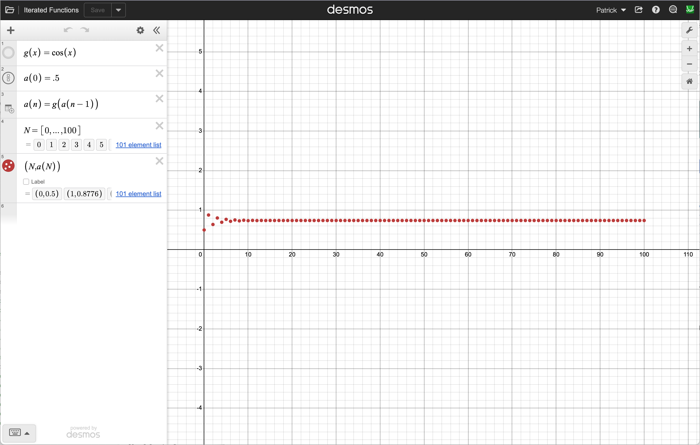

# Iterating a Function in Desmos

Desmos won't let you type `a = f(a)` and have it update itself — that's an equation to solve, not a repeatable step. Instead, define the sequence as a **function of the step number**, the same way you'd write it in code.

## Steps

1. Define the function you want to iterate:

   `g(x) = cos(x)`

2. Define the starting value as step `0`:

   `a(0) = .5`

3. Define each step in terms of the one before it:

   `a(n) = g(a(n-1))`

4. Make a list of step numbers:

   `N = [0, ..., 100]`

5. Plot the points:

   `(N, a(N))`

6. Click on the wrench and set the scale (approximately these values):

   `0 <= x <= 100`
   `-5 <= y <= 5`

Desmos fills in the whole sequence automatically — no clicking, no typing it out by hand. If the points settle onto a flat line as `N` grows, that height is the fixed point; if they fly off the screen, it's repelling.

Swap in a different `g(x)` or a different starting value in `a(0)` to try any of the functions from the [Fixed Points handout](./Fixed_Points.pdf).
