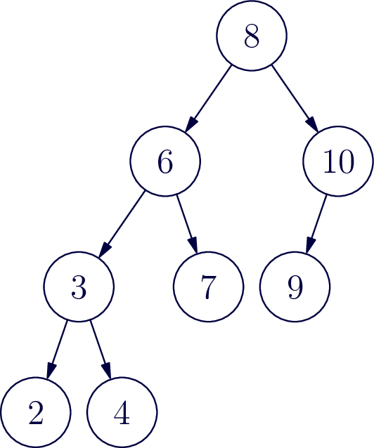
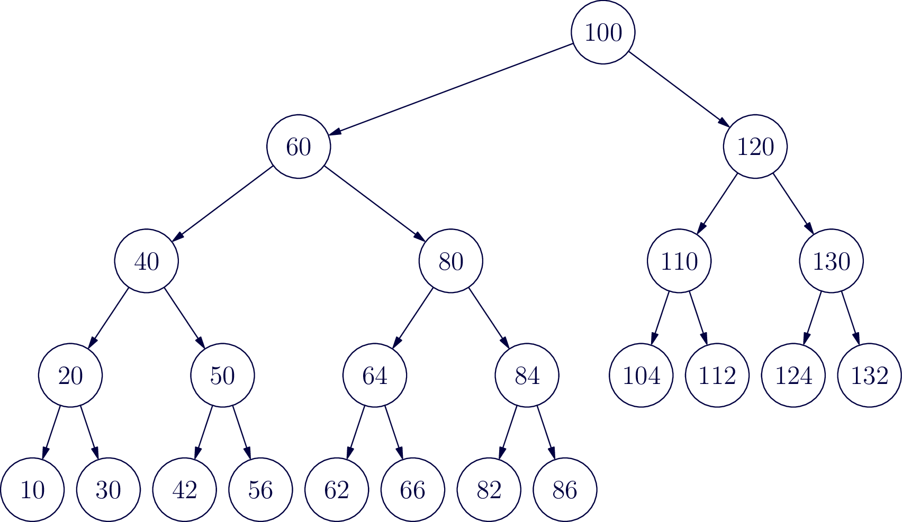

Now that you've had an introduction to AVL trees, let's take a step back and look at where this operation called rotation even comes from, and hopefully end up with a better understanding of how to balance trees, both by hand and encode.

## The Canonical Trees

Let's start by taking the numbers 1,2,3 and creating every possible valid binary search tree from these three numbers. Draw your search trees in the space below.


Answer



You should come up with five search trees. You’ll notice only one of them is balanced and the other four have balance factor of plus or minus 2. It turns out that every AVL tree, as soon as it becomes unbalanced, can be written as one of these five search trees. So if we can balance any of these five trees, we'll see how AVL tree balancing actually works.

Let's agree to call these trees the 123 tree, the 132 tree, the 213 tree, the 321 tree, and the 312 tree.

If you think about it, there's only one way to balance the four imbalanced trees and that's to convert any of them to the 213 tree. No confusing “rotations” necessary: all trees end in the same place! Of course, in most cases, the trees are working with don't just have these three nodes. They'll have other subtrees hanging off of them so let's consider this case.

## Adding Subtrees

Let’s imagine we have a bunch of real numbers, including 1, 2 and 3 and we want to put them in an AVL tree. If you think about the intervals of the real line resulting from partitioning based on these three numbers, you get four partitions: numbers less than one, numbers greater than three, numbers between one and two, and numbers between two and three. Let's call these intervals ABCD and write them as follows:

$$(A) \ldots 1 \ldots (B) \ldots 2 \ldots (C) \ldots 3 \ldots (D)$$

Where A,B,C,D are intervals of numbers. Each of these intervals corresponds to a sub tree in our AVL tree. Take each of the five trees you created above and add subtrees for A,B,C and D. Make sure that your trees are each in the appropriate location compared to the numbers 1, 2 and 3.


Answer



If you compare each of the four imbalanced trees to the balanced 213 tree, now with the subtrees added, you should see that each of the four imbalanced trees correlates to one of the four rotations you read about last class. The 123 tree is balanced with a left rotation, the 321 tree is balanced with a right rotation, the 132 tree is balanced with a right-left rotation, and finally the 312 tree is balanced with a left-right rotation. Whatever name you give these rotations they're all turning imbalanced tree into exactly the same, balanced, 213 tree.

## Example

Let's work through a moderate size example. Look at the AVL tree below it's currently balanced, but it won't be for long. Insert the number one. Once you've added one to the tree, find the lowest node in the tree that has now become unbalanced.

{width=200px}

The unbalanced tree is the sub tree rooted at 6. Now follow the path from 6 to the node that was just inserted. Draw a box around the first three numbers on that path. These numbers are arranged like a “321” tree, and can be balanced with a right rotation. Identify each of the 4 subtrees A,B,C,D (use empty set to represent any missing trees) and draw a new tree with this subtree now balanced.


Answer



Now try inserting the number 5 and go through the same balancing process.


Answer



Try a larger example. In the following tree, perform each of the following insertions (each time starting over from the same beginning tree): 5, 140, 70, 115

{width=400px}


Answer




Answer




Answer




Answer



## Algorithmic thinking:

Now let’s write some pseudocode to perform the rotations. This is where it proves advantageous to realize that these four balancing operations are each built from one or two smaller balancing operations. If you didn't realize that, you could write four separate balancing routines and they would work just fine, but let's stick with the traditional implementation and implement left balance and right balance first as two different methods. To keep things consistent use the variable names.”one” “two” and “three” and “A” “B” “C” “D” as appropriate to identify the nodes in the subtrees that you're changing in each method. You may be surprised at how few changes are actually necessary. Be sure in each method to return the root of the newly balanced sub tree.


```java
Node leftRotate(Node three)


```



```java
Node leftRotate(Node one) {
    Node two = one.right;
    one.right = two.left;
    two.left = one;
    return two;
}
```




```java
Node rightRotate(Node one)


```



```java
Node rightRotate(Node three) {
    Node two = three.left;
    three.left = two.right;
    two.right = three;
    return two;
}
```



Now you've written left and right rotate, you can write left-right and right-left rotations by calling left and right rotations on appropriate nodes and subtrees.


```java
Node leftRightRotate(Node three)


```



```java
Node leftRightRotate(Node three){
    three.left = rightRotate(three.left);
    return leftRotate(three);
}
```




```java
Node rightLeftRotate(Node one)


```



```java
Node rightLeftRotate(Node one) {
    one.right = rightRotate(one.right);
    return leftRotate(one);
}
```



The next thing we need to figure out is when each of these rotations is appropriate. If you look at our four imbalanced trees, they each have very different shapes. In the case of an insertion, a sub tree can become imbalanced when you insert a new node. That new node has to be a leaf. Look at the leaves of each of the four imbalanced trees we started with. You can tell, which of the four rotations is necessary by determining, first, if the balance factor is positive or negative (indicating a right or left imbalance), and secondly, if the new leaf node is greater than or less than its parent node. In the space below bright four different conditions which exhaustively cover the four cases of an imbalanced tree, and then say which balancing method you should call for each case. Let's assume that "node" is the root of a sub tree with balance factor greater than one or less than negative one. Also assume “data” is the integer value that has just been added to the AVL tree.

{% capture skeleton-1}
```java
/* left rotate case */
if


```

{% capture solution-1}
```java
if (bf > 1 && data > node.right.data) {
    return leftRotate(node);
}
```



{% capture skeleton-2}
```java
/* right rotate case */
if

```

{% capture solution-2}
```java
/* left-right rotate */
if


```




```java
/* right-left rotate */
if


```


```java

```





```java
/* left-right rotate */
if


```


```java

```




Finally, we have a bit of housekeeping to make this work with our existing BinaryTree insert method. You’ll want to add a `height` field that stores the height of each node (leaves have height 1 and each subtree height is 1 more than its tallest subtree.) Finally, define a `height(Node n)` method that returns the `height` of the node, or 0 if the node is `null` (this helps keep the code cleaner). We didn't show above, but you'll need to recalculate the height after each insert and rotation.


To finish this lesson, implement AVL tree rotation in your BinaryTree class by modifying your existing `insert` method (and other parts of the class as needed) You can test the accuracy first by inserting the numbers 1 - 32 and making sure the resulting tree is correct. Next, insert the integers 1-1,000,000 and it should take less than one second, or so.
