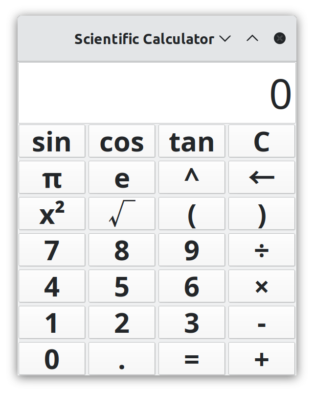

# Calculator Assignment Instructions

You are implementing a 4-function calculator. Think of a simple casio or basic calculator app. The display shows the current number you are typing, or an intermediate calculation result. It does not display any operands or other info, except the occasional "error" when appropriate. The skeleton of the program is given to you; you will update the controller and model to add functionality. First you will implement simple left-to-right evaluation using two stacks. Second you will implement operator precedence. Finally you will add extensions of your choice.

## Overview of Architecture

This calculator application follows the Model-View-Controller (MVC) design pattern:

1. **Model (`CalculatorModel.java`)**: Manages the data and calculation logic, including operand and operator stacks.
2. **View (`CalculatorUI.java`)**: Handles the user interface elements including display and buttons.
3. **Controller (`CalculatorController.java`)**: Processes user input and coordinates between the model and view.
4. **Main Application (`Calculator.java`)**: Entry point that initializes the MVC components.

Supporting classes include:
- `Operator.java`: Constants for calculator operations
- `DebugStack.java`: Extended Stack implementation for debugging

{ width=25% }

## Operand and Operator Stacks

The calculator uses two stacks to manage calculations:
- **Operand Stack**: Stores numeric values (operands) for calculations
- **Operator Stack**: Stores operators (+, -, ×, ÷, etc.)

These stacks allow for sequential processing of operations. When operations are performed, values are popped from the stacks, calculations are made, and results are pushed back.

## Methods to Complete

### In `CalculatorController.java`:

1. **`handleClear()`**: Reset the calculator state, clear display and stacks.
2. **`handleBackspace()`**: Remove the last character from the display.

### In `CalculatorModel.java`:

1. **`appendDecimalPoint()`**: Add a decimal point to the current display value if not already present.
2. **`backspace()`**: Remove the last character from the display value.
3. **`calculate()`**: Perform one calculation using operands and operators from the stacks.
4. **`reduce(String operator)`**: Calls `calculate` one or more times based on the current stack contents
5. **`precedence(String operator)`**: Return the precedence level of an operator (for Phase 2).

### In `DebugStack.java`:

Extend the Stack class to print stack contents after push, pop, and clear operations. For example:
```java
@Override
public E push(E item) {
    E result = super.push(item);
    System.out.println("Push: " + item + ", Stack: " + this);
    return result;
}
```

## Implementation Phases

### Phase 1: Basic Functionality
- Implement all the required methods
- Support basic operations (+, -, ×, ÷)
- Add support for constants π and e (hint: handle in the controller similar to digits)
- Process calculations left-to-right without operator precedence
- Implement DebugStack for debugging

### Phase 2: Operator Precedence
- Implement the `precedence()` method to assign priorities to operators
- Modify `reduce()` and related methods to respect operator precedence
- Ensure that multiplication/division are performed before addition/subtraction

### Phase 3: Extensions (Pick one or more)
- Implement parentheses support
- Add scientific functions (sin, cos, tan, sqrt, etc.)
- Add a 2nd button for arcsin, arccos, etc.
- Implement memory functions (M+, M-, MR, MC)
- Create a graphing feature for simple functions
- Support different number systems (binary, octal, hex)
- Add unit conversions
- Your idea!

## Notes

- The `DebugStack` implementation should be helpful for visualizing how the stacks change during operations
- Remember that in Phase 1, operations are performed left-to-right (no operator precedence)
- For constants like π and e, you'll need to handle these specially in the controller


## Example: Calculating a Left-to-Right Expression Using Two Stacks

Here's a simple example of how to calculate the expression `3 + 425 × 2` using the two-stack approach with left-to-right evaluation (Phase 1 approach without operator precedence):

### Initial State:
- Operand Stack: [ ]
- Operator Stack: [ ]
- Display: "0"

### User enters "3":
- Display: "3"
- No stack changes yet (value is only in display)

### User enters "+":
- Read current display value (3) and push to Operand Stack
- Push + to Operator Stack
- Operand Stack: [3]
- Operator Stack: [+]
- Display: "3"

### User enters "4":
- Display: "4"
- No stack changes yet

### User enters "2":
- Display: "42" (digits accumulate in the display)
- No stack changes yet

### User enters "5":
- Display: "425" (digits accumulate in the display)
- No stack changes yet

### User enters "×":
- Read current display value (425) and push to Operand Stack
- Operand Stack: [3, 425]
- Operator Stack: [+]

- Since we have 2 operands and 1 operator, perform calculation:
  - Pop 425 and 3 from Operand Stack
  - Pop + from Operator Stack
  - Calculate: 3 + 425 = 428
  - Push 428 to Operand Stack
- After reduction, push × to Operator Stack
- Operand Stack: [428]
- Operator Stack: [×]
- Display: "428"

### User enters "2":
- Display: "2"
- No stack changes yet (value is only in display)

### User enters "=":
- Read current display value (2) and push to Operand Stack
- Operand Stack: [428, 2]
- Operator Stack: [×]

- Since we have 2 operands and 1 operator, perform calculation:
  - Pop 2 and 428 from Operand Stack
  - Pop × from Operator Stack
  - Calculate: 428 × 2 = 856
  - Push 856 to Operand Stack
- Since "=" was pressed, we don't push it to the Operator Stack
- Operand Stack: [856]
- Operator Stack: [ ]
- Display: "856"

Note: In Phase 1, operations are performed strictly left-to-right as shown above (3 + 4 × 2 = 14). In Phase 2 with operator precedence, multiplication would be performed before addition, resulting in 3 + (4 × 2) = 11.
