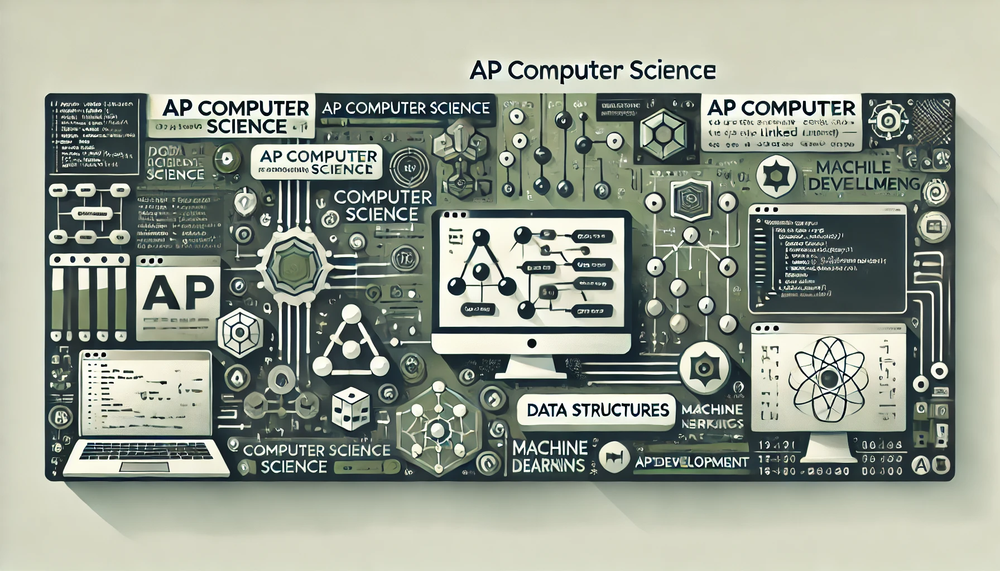

# AET Computer Science 2

(this is a template for now with sample text)

## Welcome 6th Block
Welcome to the Machine Learning class! I am thrilled to have you join us this year. Together, we'll dive into the exciting world of algorithms, data, and AI. This class is all about exploration, creativity, and pushing the boundaries of what we can achieve with machines. Let's make this a memorable and rewarding journey!

## About this Class

In this course, we will cover a wide range of topics, including:

- **Supervised Learning**: Learn about regression, classification, and model evaluation.
- **Unsupervised Learning**: Explore clustering, dimensionality reduction, and anomaly detection.
- **Neural Networks**: Get hands-on with deep learning architectures like CNNs and RNNs.
- **Reinforcement Learning**: Understand how machines can learn from their environment through trial and error.

### Class Policies

- **Attendance**: Regular attendance is crucial to keep up with the material.
- **Homework**: Assignments will be given weekly and are essential for reinforcing the concepts we cover in class.
- **Collaboration**: While collaboration on homework is encouraged, ensure that all submitted work is your own.

## Lectures & Homework

| Day   | Lecture Topic            | Homework Link             |
|-------|--------------------------|---------------------------|
| Day 1 | Introduction to ML        | [Homework 1](#)           |
| Day 2 | Linear Regression         | [Homework 2](#)           |
| Day 3 | Classification Techniques | [Homework 3](#)           |

## Single Lessons

- **[Mushrooms](lessons/mushroom.html)**

## Resources

- **[Research](background.md)** a collection of news and journal articles featuring computer science

## Topic Outlines
- **[Semester One](outline-01.md)** topic outline for classical machine learning techniques
- **[Semester Two](outline-02.md)** topic outline
for deep learning techniques

### Books

- **[Pattern Recognition and Machine Learning](https://www.springer.com/gp/book/9780387310732)** by Christopher Bishop
- **[Deep Learning](https://www.deeplearningbook.org/)** by Ian Goodfellow, Yoshua Bengio, and Aaron Courville
- **[The Elements of Statistical Learning](https://web.stanford.edu/~hastie/ElemStatLearn/)** by Trevor Hastie, Robert Tibshirani, and Jerome Friedman

### Websites

- **[Kaggle](https://www.kaggle.com/)**: A great platform to practice ML with real-world datasets.
- **[Scikit-learn](https://scikit-learn.org/)**: A Python library for simple and efficient tools for data analysis.
- **[TensorFlow](https://www.tensorflow.org/)**: An open-source platform for machine learning by Google.
- **[ArXiv](https://arxiv.org/)**: Access the latest research papers in AI and ML.

## Navigation
  * Go to [course list](../index.md)