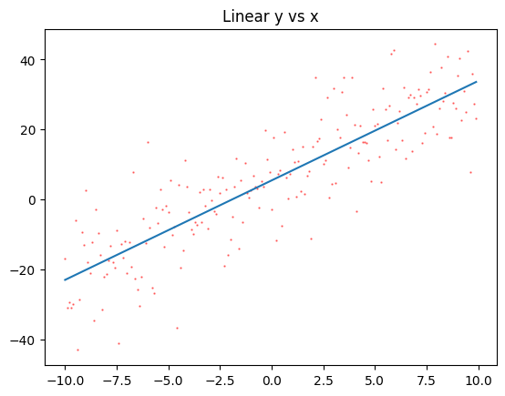
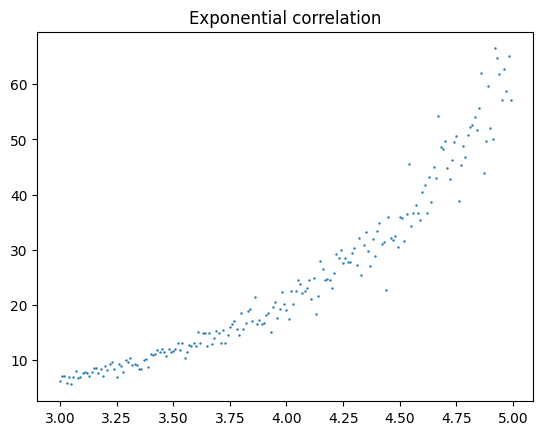
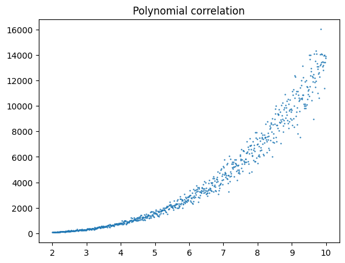

# Log-Log Regression

Linear Regression is quite capable of solving non-linear problems if you know how to properly pre-process your data. Let's look at a few types of datasets we can regress by using logarithmic transformations.

## Regular Linear Regression


```python
import numpy as np
import matplotlib.pyplot as plt
```

First let's analyze a typical linear dataset


```python
x = np.arange(-10,10,0.1)
y = 3*x + 5 + np.random.normal(0,10,len(x))

m,b = np.polyfit(x,y,1)
y_fit = np.poly1d((m,b))(x)
plt.scatter(x,y, color="red", alpha=0.5, s=0.5)
plt.plot(x,y_fit); # note the semicolon here. what does it do?
plt.title("Linear y vs x");
```


    

    


And find $r$ and $m$


```python
print(m)
np.corrcoef(x,y)
```

    3.287642692247747


    array([[1.        , 0.88075115],
           [0.88075115, 1.        ]])


## Exponential Regression

If we believe $y = Ca^x$ then by regressing $x$ against $\ln y$ we can determine $a$.

$$
\begin{array}{rl}
y &=& Ca^x \\
\ln y &=& \ln C + x \ln a \\
\end{array}
$$

This is a line with slope $\ln a$ and intercept $\ln C$


```python
x = np.arange(3,5,0.01)
y = 0.25*3**x

# add noise, but keep y > 0
for i in range(len(y)):
    while True:
        noise  = random.gauss(0,y[i]/10)
        if (y[i]+noise > 0):
            break
    y[i] += noise

plt.scatter(x,y,s=0.5);
plt.title("Exponential correlation");
```


    

    


```python
# transform y
y_t = np.log(y) ## this is ln

m,b = np.polyfit(x,y_t,1)
y_fit = np.poly1d((m,b))(x)
plt.scatter(x,y_t, color="red", alpha=0.5, s=0.5)
plt.plot(x,y_fit);
plt.title("ln(y) vs ");
```


    

    


And find $r$ and $a$ and $C$


```python
print("base = " , np.exp(m))
print("C = ", np.exp(b))
print(f"r = {np.corrcoef(x,y)[1,0]}")
```

    base =  2.9975765382313955
    C =  0.24812105741218246
    r = 0.95069612414204


## Log-Log Regression

If we believe $y = Cx^k$ then by regressing $\ln x$ against $\ln y$ we can determine $k$.

$$
\begin{array}{rl}
y &=& Cx^k \\
\ln y &=& \ln C + k \ln x \\
\end{array}
$$

This is a line with slope $k$ and intercept $\ln C$


```python
import random
```


```python
x = np.arange(2,10,0.01)
y = 10*x**3.14
for i in range(len(y)):
    while True:
        noise  = random.gauss(0,y[i]/10)
        if (y[i]+noise > 0):
            break
    y[i] += noise
plt.scatter(x,y,s=0.5);
plt.title("Polynomial correlation");
```


    

    


```python
# check y for 0
print(np.min(y))

# transform y and x
x_t = np.log(x)
y_t = np.log(y)

m,b = np.polyfit(x_t,y_t,1)
y_fit = np.poly1d((m,b))(x_t)
plt.scatter(x_t,y_t, color="red", alpha=0.5, s=0.5)
plt.plot(x_t,y_fit);
plt.title("ln(y) vs ln(x)");
```

    73.2177132494846


    

    


And find $r$ and $a$ and $C$


```python
print("degree = " , m)
print("C = ", np.exp(b))
print(f"r = {np.corrcoef(x,y)[1,0]}")
```

    degree =  3.133547086987462
    C =  10.03662528625072
    r = 0.9376281240390777

