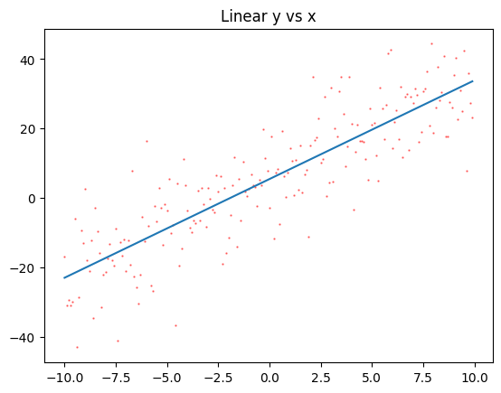
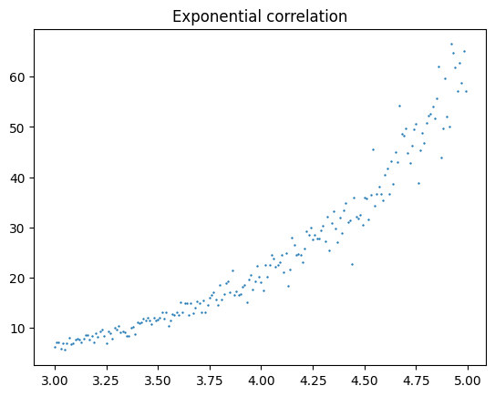
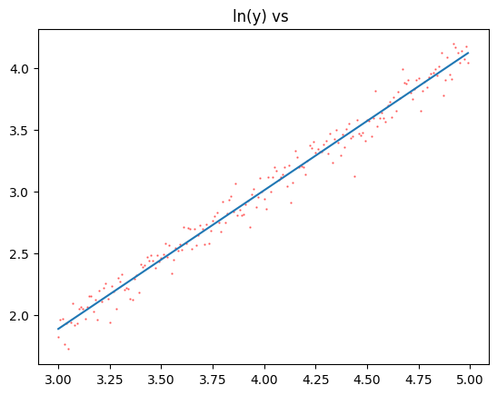
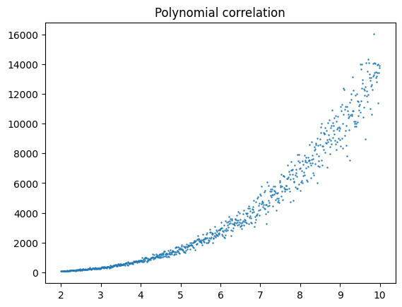

Log-Log Regression
==================

Linear Regression is quite capable of solving non-linear problems if you
know how to properly pre-process your data. Let’s look at a few types of
datasets we can regress by using logarithmic transformations.

Regular Linear Regression
-------------------------

.. code:: ipython3

    import numpy as np
    import matplotlib.pyplot as plt

First let’s analyze a typical linear dataset

.. code:: ipython3

    x = np.arange(-10,10,0.1)
    y = 3*x + 5 + np.random.normal(0,10,len(x))
    
    m,b = np.polyfit(x,y,1)
    y_fit = np.poly1d((m,b))(x)
    plt.scatter(x,y, color="red", alpha=0.5, s=0.5)
    plt.plot(x,y_fit); # note the semicolon here. what does it do?
    plt.title("Linear y vs x");

And find :math:`r` and :math:`m`

.. code:: ipython3

    print(m)
    np.corrcoef(x,y)

.. parsed-literal::

    3.287642692247747

.. parsed-literal::

    array([[1.        , 0.88075115],
           [0.88075115, 1.        ]])

Exponential Regression
----------------------

If we believe :math:`y = Ca^x` then by regressing :math:`x` against
:math:`\ln y` we can determine :math:`a`.

.. math::

   \begin{array}{rl}
   y &=& Ca^x \\
   \ln y &=& \ln C + x \ln a \\
   \end{array}

This is a line with slope :math:`\ln a` and intercept :math:`\ln C`

.. code:: ipython3

    x = np.arange(3,5,0.01)
    y = 0.25*3**x
    
    # add noise, but keep y > 0
    for i in range(len(y)):
        while True:
            noise  = random.gauss(0,y[i]/10)
            if (y[i]+noise > 0):
                break
        y[i] += noise
    
    plt.scatter(x,y,s=0.5);
    plt.title("Exponential correlation");

.. code:: ipython3

    # transform y
    y_t = np.log(y) ## this is ln
    
    m,b = np.polyfit(x,y_t,1)
    y_fit = np.poly1d((m,b))(x)
    plt.scatter(x,y_t, color="red", alpha=0.5, s=0.5)
    plt.plot(x,y_fit);
    plt.title("ln(y) vs ");

And find :math:`r` and :math:`a` and :math:`C`

.. code:: ipython3

    print("base = " , np.exp(m))
    print("C = ", np.exp(b))
    print(f"r = {np.corrcoef(x,y)[1,0]}")

.. parsed-literal::

    base =  2.9975765382313955
    C =  0.24812105741218246
    r = 0.95069612414204

Log-Log Regression
------------------

If we believe :math:`y = Cx^k` then by regressing :math:`\ln x` against
:math:`\ln y` we can determine :math:`k`.

.. math::

   \begin{array}{rl}
   y &=& Cx^k \\
   \ln y &=& \ln C + k \ln x \\
   \end{array}

This is a line with slope :math:`k` and intercept :math:`\ln C`

.. code:: ipython3

    import random

.. code:: ipython3

    x = np.arange(2,10,0.01)
    y = 10*x**3.14
    for i in range(len(y)):
        while True:
            noise  = random.gauss(0,y[i]/10)
            if (y[i]+noise > 0):
                break
        y[i] += noise
    plt.scatter(x,y,s=0.5);
    plt.title("Polynomial correlation");

.. code:: ipython3

    # check y for 0
    print(np.min(y))
    
    # transform y and x
    x_t = np.log(x)
    y_t = np.log(y)
    
    m,b = np.polyfit(x_t,y_t,1)
    y_fit = np.poly1d((m,b))(x_t)
    plt.scatter(x_t,y_t, color="red", alpha=0.5, s=0.5)
    plt.plot(x_t,y_fit);
    plt.title("ln(y) vs ln(x)");

.. parsed-literal::

    73.2177132494846

.. image:: LogLogRegression_files/LogLogRegression_18_1.png

And find :math:`r` and :math:`a` and :math:`C`

.. code:: ipython3

    print("degree = " , m)
    print("C = ", np.exp(b))
    print(f"r = {np.corrcoef(x,y)[1,0]}")

.. parsed-literal::

    degree =  3.133547086987462
    C =  10.03662528625072
    r = 0.9376281240390777

