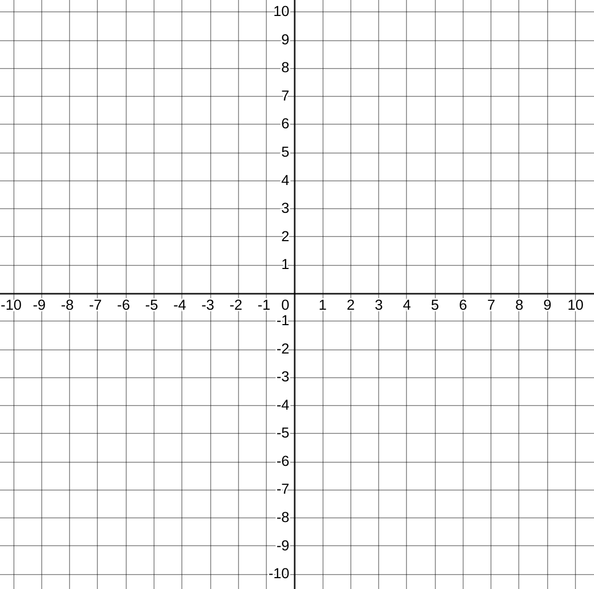

# Coordinate Transformations

In physics it is common to solve a problem by first transforming the underlying coordinate system. The motion of the moon in the Solar System is somewhat complex in a coordinate system with the sun at the origian; it is much simpler with the Earth at the origin. And simpler still with the Moon at the origin!

## Part 1: Coordinate Transformations

Given a set of axis $x,y$ which you may consider as the "standard" axis, superimpose a new set of orthogonal axes defined by the vectors ${\bf u} = \langle 2,1 \rangle$ and ${\bf v} = \langle -1,2\rangle$

1. Verify that the new axes are orthogonal
2. Draw the axes on a Cartesian plane

Points on the plane can now be identified by two separate coordinates: those in the $xy$ plane and those in the $uv$ plane. Given the points below in $uv$ coordinates, determine their $xy$ coordinates. You can solve these by graphing, but if you think about how coordinates work you can pretty easily 'math' the answer.

1. (0,0)
2. (1,1)
3. (3,1)
4. (-2,2)

{ width=75% }

If you realized the computational way to solve the above problem, try to encapsulate your algorithm succinctly as a *matrix equation*.  Spend some time on this before movin on

## Part 2: Inverse Transformations

The following 3 coordinates are in $xy$ space. Can you find their $uv$ coordinates? (Complete understanding of the previous section will render this exercise academic).

1. (5,5)
2. (-1,-3)
3. (-2,4)

Describe the mathematical way to find these answers.

In conclusion we have seen that matrices can be used to transform vectors between two related coordinate systems.

## Part 3: Linear Transformations

Another way to interpret the action of a matrix on a vector is to say that the matrix transforms the vector from one place in the place to another. If we consider the action of the matrix on every point in the plane, we can say that it provides a transformation of the plane into itself. By consider the action of the matrix on a few points in the place we can understand its action on the entire place. You will create a Jupyter notebook to explore this phenomenon.

1. Create a new notebook named "Coordinate_Transformations.ipynb"
1. Define a transformation matrix $M \in \mathbb{R}^{2 \times 2}$. You may want to use the one from part 1.
2. Define a set of 100 points lying on the edge of the unit circle.
3. Plot the points on a plane with a dashed line, and with helpful gridlines shown and a title.
4. Now transform all the points by the matrix $M$: $p_2 = M{p_1}$.
5. Plot the new set of points $p_2$ and describe what you see in a markdown cell in your notebook.
6. Try a few matrices M. Maybe even pick random uniform matrices. After a few trials, record your conclusions in a second markdown cell. In
what ways does $M$ affect the image $Mx$ for a set of $x$ on the unit circle?

Now let's look at the Singular Value Decomposition. The SVD decomposes (factors) $M$ into $M = U \Sigma V^T$ where $U$ and $V$ are
orthonormal (determinant one and their transpose is their inverse) and $\Sigma$ is a diagonal matrix.

1. Start with a symmetric matrix $M = M^T$.
2. Graph the effect of $M$ on the unit circle. (Pick a different $M$ if this one is uninteresting).
3. Find the SVD of $M$ using `U,S,VT = numpy.linalg.svd`
4. Plot the columns of $VT$ as vectors on the same plot with the ellipse you made in part 2. (Use the `quiver` function in pyplot for this)
5. Describe what you see in a markdown cell. See if you can also discern the role of $\Sigma$.
