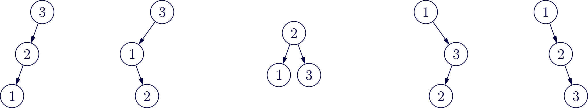

<h1 id="avl-trees">AVL Trees</h1>

Now that you’ve had an introduction to AVL trees, let’s take a step
back and look at where this operation called rotation even comes
from.

<h2 id="the-canonical-trees">The Canonical Trees</h2>

Let’s start by taking the numbers 1,2,3 and creating every possible
valid binary search tree from these three numbers.

Draw your search trees in the space below.

<figure>

<figcaption aria-hidden="true">Five Trees</figcaption>
</figure>

These are the five possible arrangements of 1, 2, and 3 in a BST.

<h2 id="code-examples">Code Examples</h2>

<pre
class="sourceCode java"><code class="sourceCode java">Node leftRotate(Node one) {
    // TODO: Implement left rotation

}</code></pre>

<pre
class="sourceCode java"><code class="sourceCode java">Node leftRotate(Node one) {
    Node two = one.right;
    one.right = two.left;
    two.left = one;
    return two;
}</code></pre>

